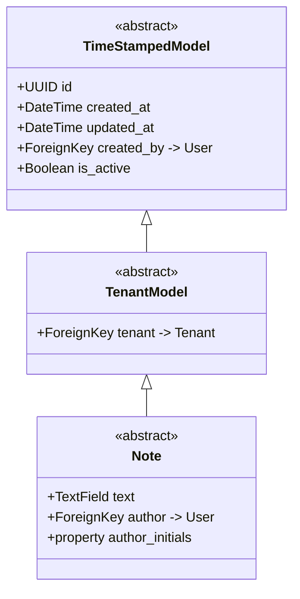
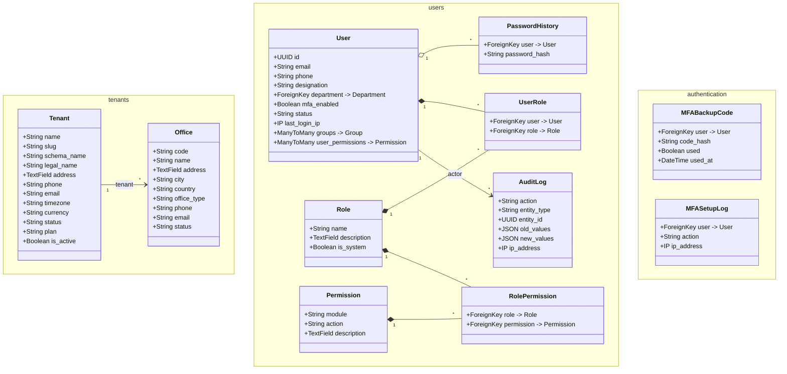
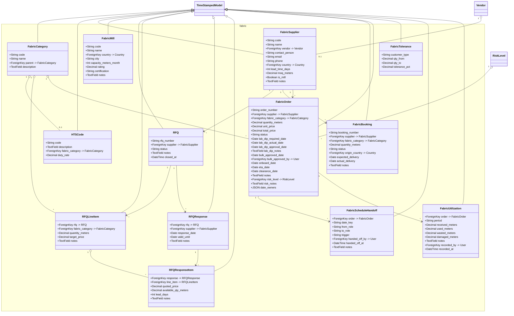
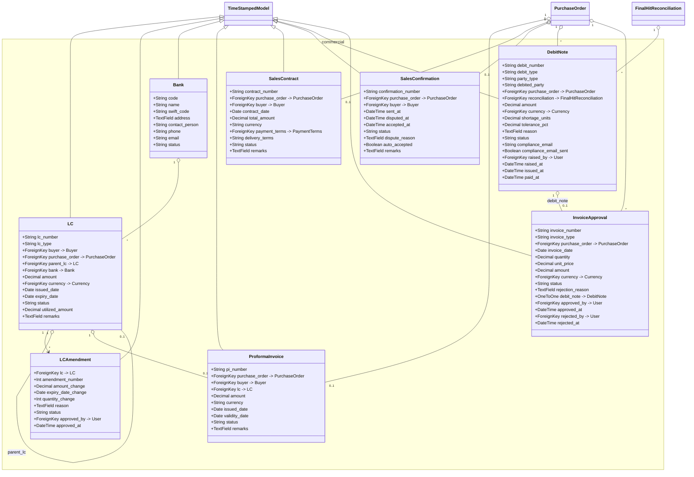
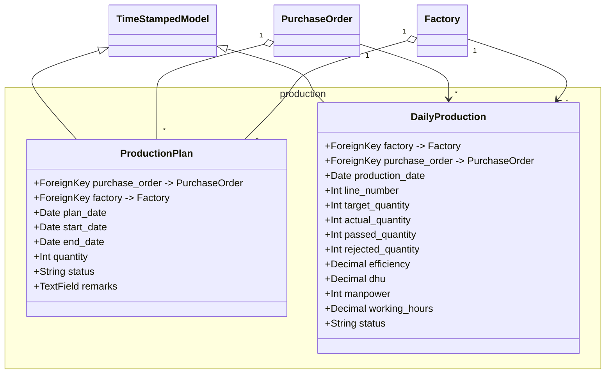
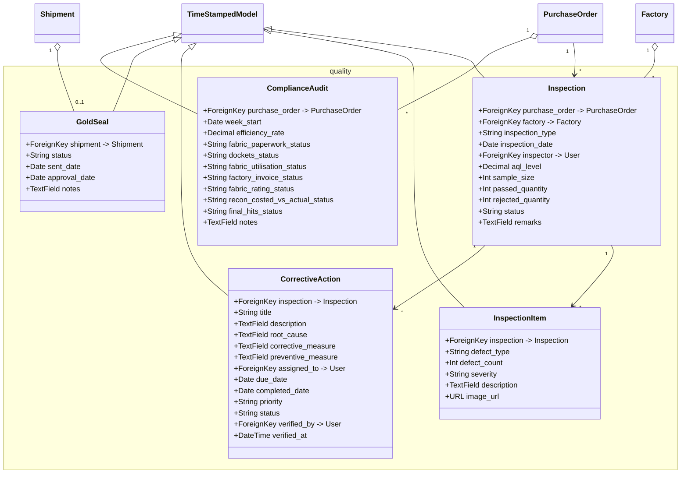
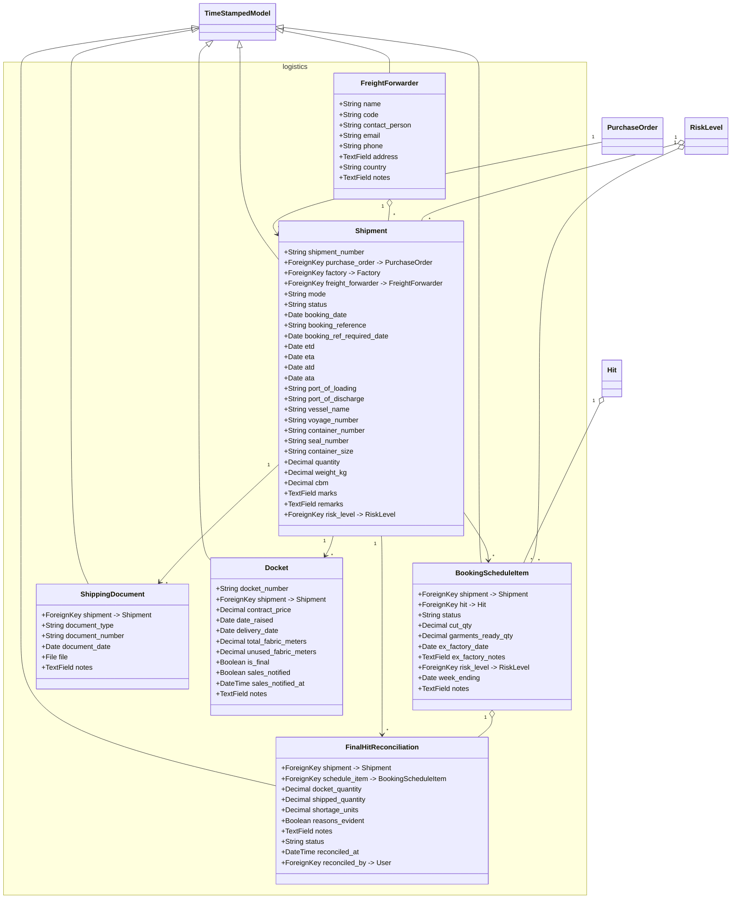
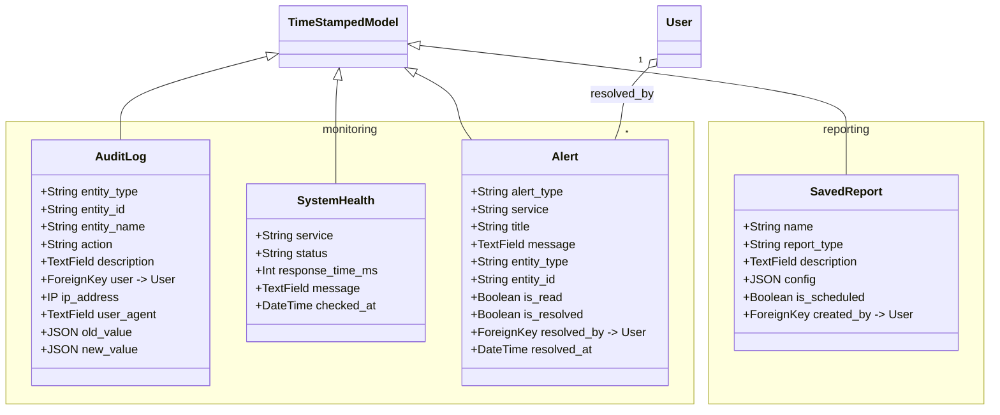

# BHMS Class Diagram (UML)

> **Standard / Delivery-ready reference** — generated from the **actual implemented Django models**
> (live introspection of `backend/apps/*/models.py`, via `django.apps.get_models()`), not from the
> legacy design docs.
>
> - **Scope:** 87 domain models across 12 business apps (+ `core` abstract bases)
> - **Relationship source:** real `ForeignKey` / `OneToOneField` / `ManyToManyField` definitions
> - **Legend:**
>   - `--|>` : inheritance (extends abstract base)
>   - `-->`  : association (ForeignKey, many-to-one; `1..*` shown where significant)
>   - `o--`  : one-to-one
>   - `*--`  : many-to-many
>   - Implied on every `TenantModel` subclass (omitted from boxes for readability):
>     `id: UUID`, `tenant -> Tenant`, `created_at`, `updated_at`, `created_by -> User`, `is_active`

---

## 0. Foundation — Abstract Base Classes (`core`)

---

## 1. Tenancy & IAM (`tenants`, `users`, `authentication`)

> `User` extends Django's `AbstractUser` (auth) — `groups`/`user_permissions` are the standard auth
> M2M. It declares its own `tenant`, `created_at`/`updated_at`/`created_by`/`is_active` fields
> directly (it does **not** inherit `TimeStampedModel`). Note there are **two distinct `AuditLog`
> models**: `users.AuditLog` (auth/access audit) and `monitoring.AuditLog` (entity change log).

---

## 2. Master Data (`setup`)

```mermaid
classDiagram
    namespace setup {
        class Season {
            +String code
            +String name
            +Date start_date
            +Date end_date
            +String status
        }
        class ProductCategory {
            +String code
            +String name
            +ForeignKey parent -> ProductCategory
            +String status
        }
        class ProductType {
            +String code
            +String name
            +ForeignKey category -> ProductCategory
            +String status
        }
        class ProductDepartment {
            +String code
            +String name
            +String status
        }
        class ComplianceDocumentType {
            +String code
            +String name
            +TextField description
            +Int validity_days
            +String status
        }
        class DeliveryMode {
            +String code
            +String name
            +TextField description
            +String status
        }
        class UOM {
            +String code
            +String name
            +String status
        }
        class Currency {
            +String code
            +String name
            +String symbol
            +Decimal exchange_rate
            +Boolean is_default
            +String status
        }
        class Department {
            +String code
            +String name
            +ForeignKey parent -> Department
            +TextField description
            +String status
        }
        class Designation {
            +String code
            +String name
            +ForeignKey department -> Department
            +TextField description
            +String status
        }
        class PaymentTerms {
            +String code
            +String name
            +Int days
            +TextField description
            +String status
        }
        class Country {
            +String code
            +String name
            +ForeignKey default_currency -> Currency
            +String status
        }
        class ColorCode {
            +String code
            +String name
            +String hex_code
            +String status
        }
        class Buyer {
            +String code
            +String name
            +String contact_person
            +String email
            +String phone
            +TextField address
            +ForeignKey country -> Country
            +ForeignKey currency -> Currency
            +ForeignKey payment_terms -> PaymentTerms
            +Decimal credit_limit
            +String status
        }
        class Brand {
            +ForeignKey buyer -> Buyer
            +String code
            +String name
            +String status
        }
        class Factory {
            +String code
            +String name
            +String contact_person
            +String email
            +String phone
            +TextField address
            +String city
            +ForeignKey country -> Country
            +Int capacity
            +String capacity_unit
            +String factory_type
            +String status
        }
        class Vendor {
            +String code
            +String name
            +String contact_person
            +String email
            +String phone
            +TextField address
            +String city
            +ForeignKey country -> Country
            +JSON product_categories
            +ForeignKey payment_terms -> PaymentTerms
            +Int lead_time_days
            +Decimal rating
            +String status
            +Boolean is_approved
            +ForeignKey approved_by -> User
            +DateTime approved_at
        }
        class RiskLevel {
            +String code
            +String name
            +String color
            +TextField description
            +Int sort_order
            +String status
        }
    }
    TimeStampedModel <|-- Season
    TimeStampedModel <|-- ProductCategory
    TimeStampedModel <|-- ProductType
    TimeStampedModel <|-- ProductDepartment
    TimeStampedModel <|-- ComplianceDocumentType
    TimeStampedModel <|-- DeliveryMode
    TimeStampedModel <|-- UOM
    TimeStampedModel <|-- Currency
    TimeStampedModel <|-- Department
    TimeStampedModel <|-- Designation
    TimeStampedModel <|-- PaymentTerms
    TimeStampedModel <|-- Country
    TimeStampedModel <|-- ColorCode
    TimeStampedModel <|-- Buyer
    TimeStampedModel <|-- Brand
    TimeStampedModel <|-- Factory
    TimeStampedModel <|-- Vendor
    TimeStampedModel <|-- RiskLevel

    ProductCategory "1" o-- "0..1" ProductType : category
    Department "1" o-- "0..1" Designation : department
    Country "1" o-- "0..1" Buyer : country
    Currency "1" o-- "0..1" Buyer : currency
    PaymentTerms "1" o-- "0..1" Buyer : payment_terms
    Buyer "1" --> "*" Brand
    Country "1" o-- "*" Factory
    Country "1" o-- "*" Vendor
    PaymentTerms "1" o-- "*" Vendor
    Department "1" o-- "*" User : users.department
```

> All classes above extend `TenantModel` (i.e., `TimeStampedModel` → `TenantModel`). Self-referencing
> hierarchies exist on `ProductCategory.parent` and `Department.parent`.

---

## 3. Merchandising (`merchandising`)

```mermaid
classDiagram
    namespace merchandising {
        class Style {
            +String style_number
            +String name
            +TextField description
            +ForeignKey buyer -> Buyer
            +ForeignKey brand -> Brand
            +ForeignKey category -> ProductCategory
            +ForeignKey product_type -> ProductType
            +ForeignKey department -> ProductDepartment
            +ForeignKey season -> Season
            +File tech_pack
            +Image sketch_front
            +Image sketch_back
            +Image sketch_side
            +Image sketch_detail
            +Int current_version
            +String status
        }
        class StyleVersion {
            +ForeignKey style -> Style
            +Int version_number
            +TextField revision_notes
            +String status
        }
        class FileOpening {
            +String file_number
            +ForeignKey style -> Style
            +ForeignKey style_version -> StyleVersion
            +ForeignKey buyer -> Buyer
            +ForeignKey brand -> Brand
            +ForeignKey factory -> Factory
            +Date file_date
            +String status
            +TextField remarks
            +ForeignKey risk_level -> RiskLevel
            +Boolean is_quick_lead
            +JSON quick_lead_agreed_by
            +ForeignKey original_fn -> FileOpening
            +Boolean is_repeat
            +JSON repeat_approved_by
            +Boolean is_stock_fabric
            +Decimal total_meters
            +Decimal allocated_meters
            +Image stock_photo
        }
        class StockFabricAllocation {
            +ForeignKey stock -> FileOpening
            +ForeignKey allocated_to -> FileOpening
            +Decimal meters
            +Date allocated_date
            +TextField notes
        }
        class FileOpeningNote {
            +ForeignKey file_opening -> FileOpening
        }
        class PurchaseOrder {
            +String po_number
            +ForeignKey file_opening -> FileOpening
            +ForeignKey buyer -> Buyer
            +ForeignKey brand -> Brand
            +ForeignKey factory -> Factory
            +Date po_date
            +Date delivery_date
            +ForeignKey destination_country -> Country
            +String destination_port
            +Int quantity
            +Decimal unit_price
            +Decimal total_value
            +ForeignKey currency -> Currency
            +ForeignKey payment_terms -> PaymentTerms
            +ForeignKey delivery_mode -> DeliveryMode
            +String status
            +TextField remarks
            +ForeignKey risk_level -> RiskLevel
        }
        class POAmendment {
            +ForeignKey purchase_order -> PurchaseOrder
            +String amendment_number
            +String field_name
            +TextField old_value
            +TextField new_value
            +TextField reason
            +String status
            +ForeignKey approved_by -> User
            +DateTime approved_at
        }
        class PurchaseOrderItem {
            +ForeignKey purchase_order -> PurchaseOrder
            +ForeignKey color -> ColorCode
            +String size
            +Int quantity
            +Decimal unit_price
        }
        class Hit {
            +ForeignKey purchase_order -> PurchaseOrder
            +String hit_number
            +ForeignKey colour -> ColorCode
            +String delivery_mode
            +String delivery_type
            +ForeignKey factory_override -> Factory
            +Date original_delivery_date
            +Date actual_delivery_date
        }
        class FitSpec {
            +ForeignKey purchase_order -> PurchaseOrder
            +String fit_stage
            +Int version
            +JSON measurements
            +JSON images
            +TextField notes
            +Boolean is_current
        }
        class BOM {
            +ForeignKey style_version -> StyleVersion
            +String name
            +Int version
            +String status
        }
        class BOMItem {
            +ForeignKey bom -> BOM
            +String category
            +String item_name
            +TextField description
            +ForeignKey uom -> UOM
            +Decimal consumption
            +Decimal waste_percent
            +Decimal unit_price
            +ForeignKey vendor -> Vendor
            +ForeignKey supplier -> Vendor
            +Decimal ordered_qty
            +Decimal delivered_qty
            +Date eta_date
            +Date confirmed_date
            +Date actual_date
            +String status
        }
        class StyleItem {
            +ForeignKey style -> Style
            +String category
            +String item_name
            +TextField description
            +ForeignKey uom -> UOM
            +Decimal consumption
            +Decimal waste_percent
            +Decimal unit_price
            +ForeignKey vendor -> Vendor
            +Int sort_order
        }
        class DesignImage {
            +ForeignKey style -> Style
            +Image image
            +String role
            +String caption
            +String colourway
            +Int sort_order
            +Boolean is_main
        }
        class Costing {
            +ForeignKey purchase_order -> PurchaseOrder
            +ForeignKey bom -> BOM
            +Int version
            +String status
            +String sheet_type
            +Boolean is_live
            +Decimal exchange_rate
            +Decimal target_price
            +Decimal fabric_cost
            +Decimal trim_cost
            +Decimal cm_cost
            +Decimal overhead_cost
            +Decimal total_cost
            +Decimal margin
            +ForeignKey approved_by -> User
            +Boolean is_single_size
            +JSON size_ratio
            +Boolean confirmed
            +Boolean is_patterned
            +JSON patterned_fabric_options
        }
        class CostingLine {
            +ForeignKey costing -> Costing
            +String category
            +String description
            +Decimal unit_price
            +Decimal consumption
            +Boolean is_additional
            +String size_width
            +Int sort_order
        }
        class TA {
            +OneToOne purchase_order -> PurchaseOrder
            +String status
            +Date delivery_date
            +JSON critical_path
        }
        class TAMilestone {
            +ForeignKey ta -> TA
            +String name
            +TextField description
            +Date planned_date
            +Date actual_date
            +String status
            +ForeignKey assigned_to -> User
            +Boolean is_critical
            +Int sort_order
        }
        class JobRequest {
            +String job_number
            +String job_type
            +ForeignKey style -> Style
            +ForeignKey purchase_order -> PurchaseOrder
            +TextField description
            +String work_location
            +ForeignKey assigned_to -> User
            +Date required_by_date
            +Int priority
            +String status
            +TextField notes
        }
    }
    TimeStampedModel <|-- Style
    TimeStampedModel <|-- StyleVersion
    TimeStampedModel <|-- FileOpening
    TimeStampedModel <|-- StockFabricAllocation
    TenantModel <|-- FileOpeningNote
    TimeStampedModel <|-- PurchaseOrder
    TimeStampedModel <|-- POAmendment
    TimeStampedModel <|-- PurchaseOrderItem
    TimeStampedModel <|-- Hit
    TimeStampedModel <|-- FitSpec
    TimeStampedModel <|-- BOM
    TimeStampedModel <|-- BOMItem
    TimeStampedModel <|-- StyleItem
    TimeStampedModel <|-- DesignImage
    TimeStampedModel <|-- Costing
    TimeStampedModel <|-- CostingLine
    TimeStampedModel <|-- TA
    TimeStampedModel <|-- TAMilestone
    TimeStampedModel <|-- JobRequest

    Buyer "1" --> "*" Style
    Style "1" --> "*" StyleVersion
    Style "1" o-- "*" FileOpening : opened for
    StyleVersion "1" o-- "0..1" FileOpening
    FileOpening "1" o-- "*" FileOpeningNote
    FileOpening "1" o-- "*" StockFabricAllocation : stock
    FileOpening "1" o-- "0..1" FileOpening : original_fn
    FileOpening "1" o-- "0..1" PurchaseOrder : linked
    PurchaseOrder "1" --> "*" PurchaseOrderItem
    PurchaseOrder "1" --> "*" POAmendment
    PurchaseOrder "1" --> "*" Hit
    PurchaseOrder "1" o-- "0..1" FitSpec
    PurchaseOrder "1" o-- "0..1" TA
    PurchaseOrder "1" --> "*" Costing
    BOM "1" --> "*" BOMItem
    Style "1" --> "*" StyleItem
    Style "1" --> "*" DesignImage
    Costing "1" --> "*" CostingLine
    TA "1" --> "*" TAMilestone
    Style "1" --> "*" JobRequest
    Vendor "1" o-- "*" BOMItem : supplier
    UOM "1" o-- "*" BOMItem
    RiskLevel "1" o-- "*" FileOpening
    RiskLevel "1" o-- "*" PurchaseOrder
```

> `FileOpening` is the domain hub: it connects a `Style`/`StyleVersion` to a `Buyer`, `Factory`,
> and risk profile, and supports **quick-lead**, **repeat** and **stock-fabric** sourcing variants.
> `Note` (core) is the base for `FileOpeningNote`.

---

## 4. Fabric Management (`fabric`)

> RFQ workflow: `RFQ` → `RFQLineItem` ↔ `RFQResponse` → `RFQResponseItem` (per-line quotes).

---

## 5. Commercial & Finance (`commercial`)

> `InvoiceApproval.debit_note` is a **one-to-one**; a rejected invoice may create a linked
> `DebitNote`. `DebitNote.reconciliation` ties shortages to `FinalHitReconciliation` (logistics).

---

## 6. Production (`production`)

---

## 7. Quality & Compliance (`quality`)

> `ComplianceAudit` aggregates the 8 weekly status checks (fabric paperwork, dockets,
> utilisation, factory invoice, fabric rating, recon vs actual, final hits).

---

## 8. Logistics (`logistics`)

> `BookingScheduleItem` links each shipment line to a `Hit`; `FinalHitReconciliation` compares
> docket vs shipped quantity and feeds shortage-driven `DebitNote`s in commercial.

---

## 9. Monitoring & Reporting (`monitoring`, `reporting`)

---

## Appendix A — Model Inventory (by app)

| App | Models | Count |
|-----|--------|-------|
| `core` | `TimeStampedModel`, `TenantModel`, `Note` *(abstract)* | 3 |
| `tenants` | `Tenant`, `Office` | 2 |
| `users` | `User`, `PasswordHistory`, `Role`, `UserRole`, `Permission`, `RolePermission`, `AuditLog` | 7 |
| `authentication` | `MFABackupCode`, `MFASetupLog` | 2 |
| `setup` | `Season`, `ProductCategory`, `ProductType`, `ProductDepartment`, `ComplianceDocumentType`, `DeliveryMode`, `UOM`, `Currency`, `Department`, `Designation`, `PaymentTerms`, `Country`, `ColorCode`, `Buyer`, `Brand`, `Factory`, `Vendor`, `RiskLevel` | 18 |
| `merchandising` | `Style`, `StyleVersion`, `FileOpening`, `StockFabricAllocation`, `FileOpeningNote`, `PurchaseOrder`, `POAmendment`, `PurchaseOrderItem`, `Hit`, `FitSpec`, `BOM`, `BOMItem`, `StyleItem`, `DesignImage`, `Costing`, `CostingLine`, `TA`, `TAMilestone`, `JobRequest` | 19 |
| `fabric` | `FabricCategory`, `HTSCode`, `FabricSupplier`, `FabricMill`, `RFQ`, `RFQLineItem`, `RFQResponse`, `RFQResponseItem`, `FabricBooking`, `FabricOrder`, `FabricTolerance`, `FabricScheduleHandoff`, `FabricUtilization` | 13 |
| `commercial` | `LC`, `LCAmendment`, `Bank`, `ProformaInvoice`, `SalesContract`, `SalesConfirmation`, `DebitNote`, `InvoiceApproval` | 8 |
| `production` | `ProductionPlan`, `DailyProduction` | 2 |
| `quality` | `Inspection`, `InspectionItem`, `CorrectiveAction`, `GoldSeal`, `ComplianceAudit` | 5 |
| `logistics` | `FreightForwarder`, `Shipment`, `BookingScheduleItem`, `ShippingDocument`, `Docket`, `FinalHitReconciliation` | 6 |
| `monitoring` | `AuditLog`, `SystemHealth`, `Alert` | 3 |
| `reporting` | `SavedReport` | 1 |
| **Total (business models)** | | **86** |

---

*Generated from live Django model introspection. Regenerate after model changes with:*
`python manage.py shell -c "from django.apps import apps; [print(m.__module__, m.__name__) for app in apps.get_app_configs() for m in app.get_models()]"`
