# Workflow Diagrams
# BHMS - Buying House Management System

---

## Table of Contents

1. [Order Lifecycle](#1-order-lifecycle)
2. [T&A Process](#2-ta-process)
3. [Costing Workflow](#3-costing-workflow)
4. [Procurement Workflow](#4-procurement-workflow)
5. [Commercial Workflow](#5-commercial-workflow)
6. [Shipment Workflow](#6-shipment-workflow)
7. [Production Workflow](#7-production-workflow)
8. [Approval Workflow](#8-approval-workflow)

---

## 1. Order Lifecycle (Style → File Opening → PO)

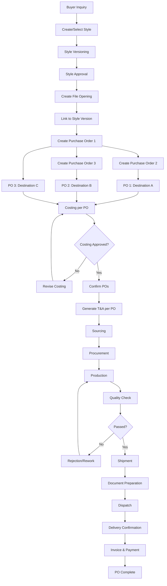

### Style-Version-File-PO Hierarchy

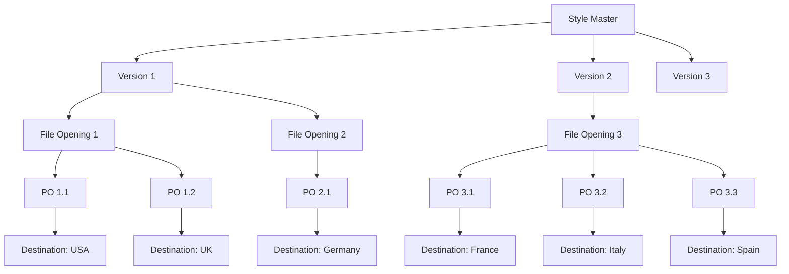

---

## 2. T&A Process (Per PO)

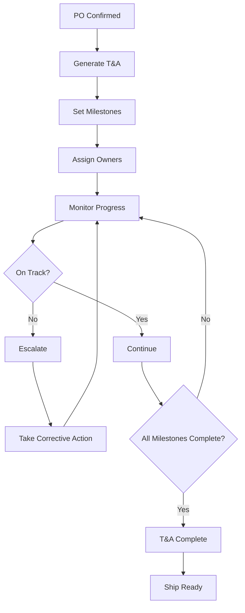

### T&A Milestones (Per PO)

```mermaid
flowchart LR
    A[PO Confirmed] --> B[Pattern Making]
    B --> C[Fabric Sourcing]
    C --> D[Sample Development]
    D --> E[Lab Dip Approval]
    E --> F[Bulk Fabric Order]
    F --> G[Trim Sourcing]
    G --> H[Production Planning]
    H --> I[Production Start]
    I --> J[Quality Inspection]
    J --> K[Packing]
    K --> L[Shipment Ready]
```

### T&A Timeline (Multiple POs per Style)

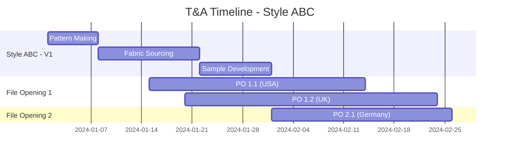

---

## 3. Costing Workflow

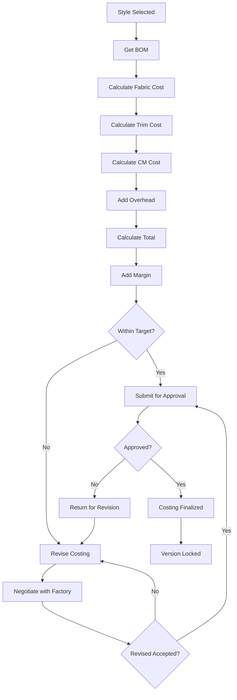

---

## 4. Procurement Workflow

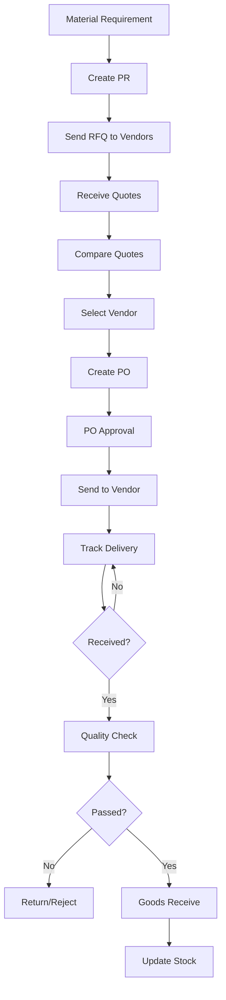

---

## 5. Commercial Workflow

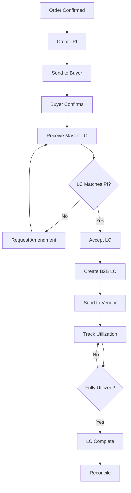

---

## 6. Shipment Workflow

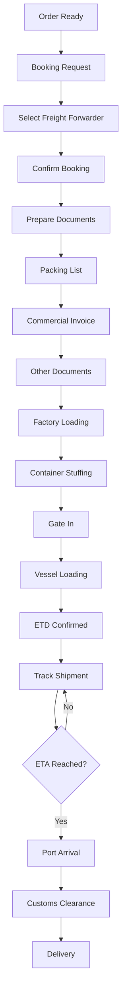

---

## 7. Production Workflow

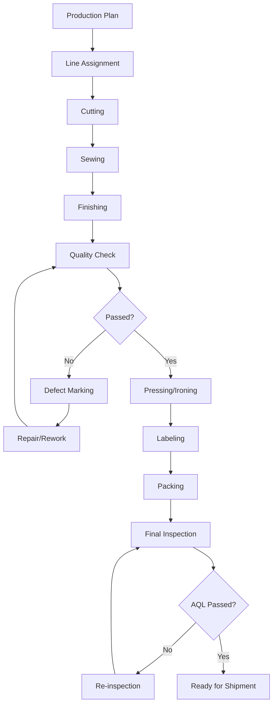

### Daily Production Reporting

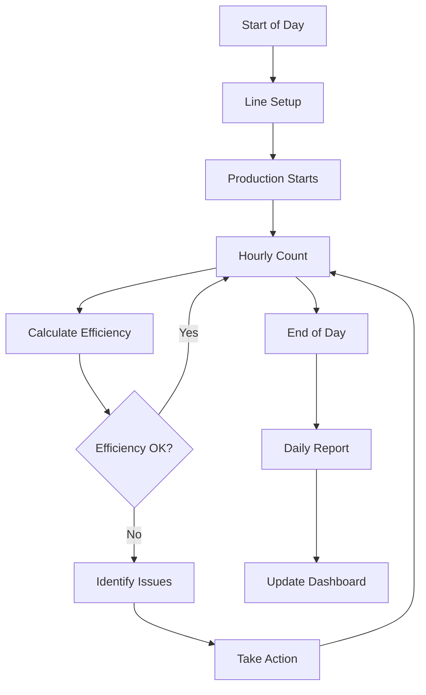

---

## 8. Approval Workflow

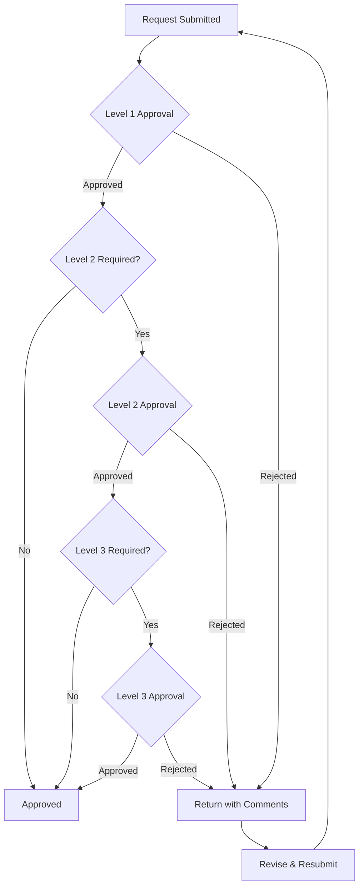

### Approval Matrix

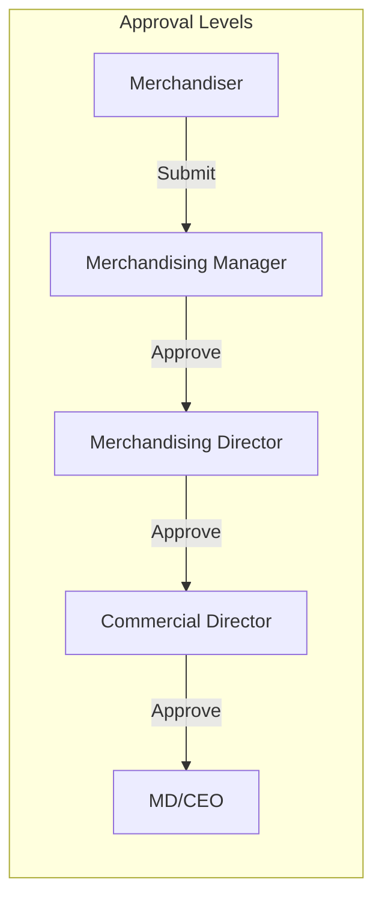

---

## 9. Quality Inspection Flow

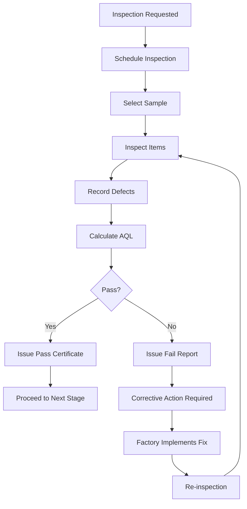

---

## 10. Document Flow

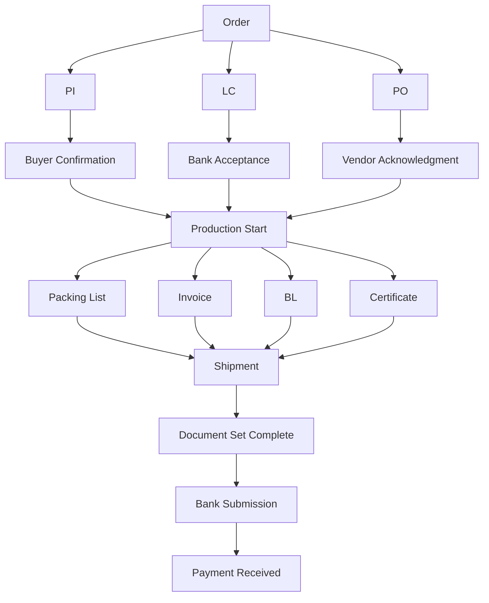

---

*These diagrams should be reviewed by Business Analyst and Solution Architect before implementation.*
